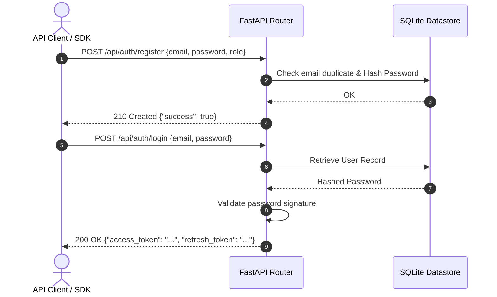
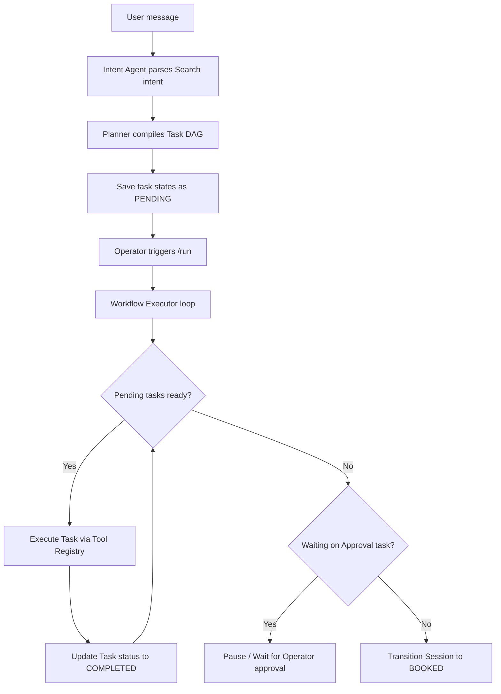

# TravelOps AI — API Reference & Integrations Guide

This document provides a comprehensive integration manual for the TravelOps AI Gateway. It includes cURL request templates, response schemas, and system interaction diagrams.

---

## 🏗️ System Visual Diagrams

### 1. Database Entity-Relationship (ER) Model
This diagram maps the relational SQLite schema defined in the database layer.

```mermaid
erDiagram
    users {
        int id PK
        string email UNIQUE
        string password_hash
        string name
        string role
        datetime created_at
    }
    sessions {
        string session_id PK
        int user_id FK
        datetime created_at
        datetime updated_at
    }
    workflow_states {
        int id PK
        string session_id
        string state
        datetime updated_at
    }
    task_states {
        int id PK
        string session_id
        string task_id
        string name
        string status
        string dependencies_raw
        string input_raw
        string output_raw
        datetime created_at
        datetime updated_at
    }
    audit_logs {
        int id PK
        string session_id
        string agent_name
        string action
        string reasoning_summary
        string payload_raw
        datetime created_at
    }
    event_store {
        string id PK
        string event_type
        string session_id
        string payload_raw
        datetime timestamp
    }
    bus_inventory {
        int id PK
        string operator_name
        string bus_type
        string departure_time
        string arrival_time
        string duration
        string origin
        string destination
        float fare
        float rating
        int available_seats
        string seat_layout_raw
    }
    bookings {
        int id PK
        string session_id
        int user_id FK
        int bus_id FK
        string pnr UNIQUE
        string seat_number
        string status
        string passenger_name
        string passenger_email
        float price_paid
        datetime created_at
    }

    users ||--o{ sessions : "owns"
    users ||--o{ bookings : "has"
    sessions ||--o{ workflow_states : "logs"
    sessions ||--o{ task_states : "executes"
    sessions ||--o{ audit_logs : "audits"
    sessions ||--o{ event_store : "triggers"
    sessions ||--o{ bookings : "books"
    bus_inventory ||--o{ bookings : "allocated_in"
```

---

### 2. User Authentication Sequence
The secure registration and token-refresh lifecycle.



---

### 3. Workflow DAG Compile & Run Loop
The runtime loop representing intent extraction, task planning, and asynchronous graph execution.



---

## 📡 API Reference Sheet

### 1. Registration
* **Endpoint**: `POST /api/auth/register`
* **Content-Type**: `application/json`
* **Request Payload**:
  ```json
  {
    "email": "operator@travelops.ai",
    "password": "SecurePassword123",
    "name": "Jane Operator",
    "role": "operator"
  }
  ```
* **cURL Command**:
  ```bash
  curl -X POST http://localhost:8000/api/auth/register \
    -H "Content-Type: application/json" \
    -d '{"email":"operator@travelops.ai","password":"SecurePassword123","name":"Jane Operator","role":"operator"}'
  ```

### 2. Login & JWT Issuance
* **Endpoint**: `POST /api/auth/login`
* **Content-Type**: `application/json`
* **Request Payload**:
  ```json
  {
    "email": "operator@travelops.ai",
    "password": "SecurePassword123"
  }
  ```
* **cURL Command**:
  ```bash
  curl -X POST http://localhost:8000/api/auth/login \
    -H "Content-Type: application/json" \
    -d '{"email":"operator@travelops.ai","password":"SecurePassword123"}'
  ```

### 3. Create Session
* **Endpoint**: `POST /api/sessions`
* **Headers**: `Authorization: Bearer <JWT_ACCESS_TOKEN>`
* **Request Payload**:
  ```json
  {
    "session_id": "sess_manual_101"
  }
  ```
* **cURL Command**:
  ```bash
  curl -X POST http://localhost:8000/api/sessions \
    -H "Authorization: Bearer YOUR_ACCESS_TOKEN" \
    -H "Content-Type: application/json" \
    -d '{"session_id":"sess_manual_101"}'
  ```

### 4. Submit Chat Query (Intent Extraction)
* **Endpoint**: `POST /api/sessions/{session_id}/message`
* **Headers**: `Authorization: Bearer <JWT_ACCESS_TOKEN>`
* **Request Payload**:
  ```json
  {
    "message": "Search for buses from Bangalore to Chennai tomorrow"
  }
  ```
* **cURL Command**:
  ```bash
  curl -X POST http://localhost:8000/api/sessions/sess_manual_101/message \
    -H "Authorization: Bearer YOUR_ACCESS_TOKEN" \
    -H "Content-Type: application/json" \
    -d '{"message":"Search for buses from Bangalore to Chennai tomorrow"}'
  ```

### 5. Execute Plan DAG
* **Endpoint**: `POST /api/sessions/{session_id}/run`
* **Headers**: `Authorization: Bearer <JWT_ACCESS_TOKEN>`
* **cURL Command**:
  ```bash
  curl -X POST http://localhost:8000/api/sessions/sess_manual_101/run \
    -H "Authorization: Bearer YOUR_ACCESS_TOKEN"
  ```

### 6. Manual Task Bypass (Operator Approval)
* **Endpoint**: `POST /api/sessions/{session_id}/approve`
* **Headers**: `Authorization: Bearer <JWT_ACCESS_TOKEN>`
* **Request Payload**:
  ```json
  {
    "task_id": "hold_1"
  }
  ```
* **cURL Command**:
  ```bash
  curl -X POST http://localhost:8000/api/sessions/sess_manual_101/approve \
    -H "Authorization: Bearer YOUR_ACCESS_TOKEN" \
    -H "Content-Type: application/json" \
    -d '{"task_id":"hold_1"}'
  ```

### 7. Trigger Disruption Telemetry (Simulate Outages)
* **Endpoint**: `POST /api/events/publish`
* **Headers**: `Authorization: Bearer <JWT_ACCESS_TOKEN>`
* **Request Payload**:
  ```json
  {
    "event_type": "BusCancelled",
    "payload": {
      "session_id": "sess_manual_101",
      "operator_name": "VRL Travels",
      "route_id": "route_blr_che_1",
      "cancelled_at": "2026-06-29T10:00:00Z"
    }
  }
  ```
* **cURL Command**:
  ```bash
  curl -X POST http://localhost:8000/api/events/publish \
    -H "Authorization: Bearer YOUR_ACCESS_TOKEN" \
    -H "Content-Type: application/json" \
    -d '{"event_type":"BusCancelled","payload":{"session_id":"sess_manual_101","operator_name":"VRL Travels","route_id":"route_blr_che_1","cancelled_at":"2026-06-29T10:00:00Z"}}'
  ```

---

## ⚡ Error Standard Codes

| HTTP Code | Error Type | Cause / Explanation |
|---|---|---|
| `400` | `ValidationError` | Decoupled guardrails, email duplicate, or business policy constraints failed. |
| `401` | `AuthError` | Access Token has expired or lacks token signature. |
| `403` | `AuthError` | User is a Passenger role but endpoint requires Operator/Admin role access. |
| `429` | `RateLimitError` | Gateway rate limiter limits exceeded (defaults to 150 requests/min). |
| `500` | `APIError` | Internal platform exception or unhandled routing adapter exception. |
