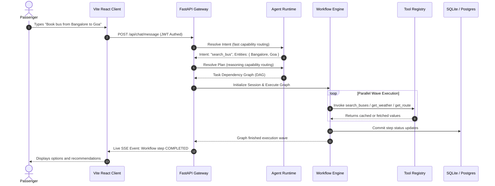

# System Architecture

TravelOps AI is designed as a production-grade, event-driven travel operations platform. It adheres to a strict separation of concerns, dividing execution into distinct layers to isolate cognitive reasoning from deterministic, transactional state machine steps.

---

## 🗺️ 7-Layer Architecture Overview

The system is organized into the following layers:

```
┌────────────────────────────────────────────────────────┐
│ 1. PRESENTATION LAYER (VITE React Single Page App)     │
│    Shows live Chat stream, DAG graphs, & telemetry log │
├────────────────────────────────────────────────────────┤
│ 2. CONVERSATION & CONTEXT LAYER (Session & Leases)     │
│    Applies PII Guardrails, sliding budgets, and cache  │
├────────────────────────────────────────────────────────┤
│ 3. PLANNING & WORKFLOW LAYER (Orchestrator)            │
│    Resolves intent and generates Workflow Task DAGs    │
├────────────────────────────────────────────────────────┤
│ 4. AGENT RUNTIME LAYER (Registry & Safety Gates)       │
│    Dispatches goals to capability-mapped agents        │
├────────────────────────────────────────────────────────┤
│ 5. TOOL EXECUTION LAYER (Circuit Breakers & Idempotency)│
│    Invokes external REST/gRPC API adapters             │
├────────────────────────────────────────────────────────┤
│ 6. EVENT & AUTOMATION LAYER (Async Event Bus)          │
│    Handles out-of-band events and schedule monitors    │
├────────────────────────────────────────────────────────┤
│ 7. STORAGE & OBSERVABILITY LAYER (Relational DB)       │
│    Performs SQL logging, metrics, and trace dumps      │
└────────────────────────────────────────────────────────┘
```

1. **Presentation Layer**: Built on Vite React. Provides a clean chat window with live status updating, a SVG graph viewer drawing active DAG execution states, and audit logs.
2. **Conversation & Context Layer**: Isolates active user contexts. Enforces security guardrails to sanitize input strings and routes query construction through a token budget optimizer.
3. **Planning & Workflow Layer**: Compiles declarative workflow blueprints (`.yaml` schemas) into runtime DAG objects, scheduling execution waves concurrently.
4. **Agent Runtime Layer**: Dispatches agent requests via capability registry checks, monitoring node health, model routing, and version policies.
5. **Tool Execution Layer**: Houses concrete operational wrappers (Bus Search, Payment, Seat Hold, PNR Confirmations). Enforces system reliability via Circuit Breakers and namespaced Idempotency Keys.
6. **Event & Automation Layer**: Runs an asynchronous message dispatch bus. Triggers autonomous recovery rebookings when journey monitors receive cancellation updates (e.g. `BusCancelled`).
7. **Storage & Observability Layer**: Connects to the SQL engine (SQLite locally or PostgreSQL in production) to commit transaction audits, session traces, and `/metrics` telemetry endpoints.

---

## 🔄 Execution Data Flow Pipeline

The end-to-end processing of a user travel request follows a structured path:



---

## 🧠 Cognitive vs. Deterministic Separation

To guarantee transaction consistency, TravelOps AI draws a strict boundary:
* **Cognitive Agents (LLM)**: Analyze user statements, customize itinerary recommendations, and self-repair failed steps by analyzing stdout/stderr errors. They do **not** directly write to user balances, delete rows, or commit reservations.
* **Deterministic Services (Code)**: Perform database transactions, charge payment models, check physical seat tables, and verify authorization signatures. They execute with high reliability (retry policies, circuit breakers) and expose predictable interfaces.
