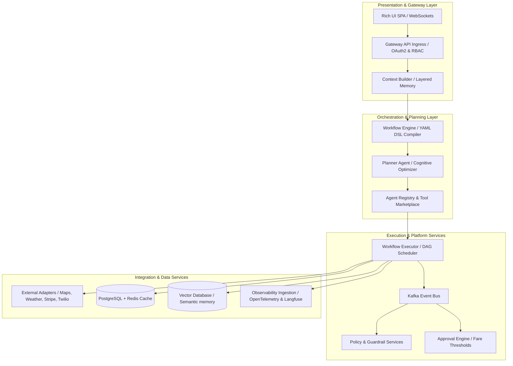

# TravelOps AI v2.0 — Enterprise AI Platform Roadmap

This document outlines the architectural blueprint and operational roadmap to evolve **TravelOps AI** from a high-quality Minimum Viable Product (v1.0) into a production-grade **Enterprise Travel AI Platform (v2.0)**.

---

## 🗺️ Architectural Evolution

In version 1.0, cognitive components directly orchestrated mock APIs with inline Python task graphs. In version 2.0, the platform moves toward a strict separation of concerns, routing request contexts through a deterministic gateway layer down to dynamic agent registries, sandboxed tools, and a decoupled event bus.

### Version 2.0 Layered Core Architecture



---

## 🏛️ The 15 Pillars of Enterprise AI Platform

### Pillar 1 — Declarative Workflow Engine
* **Objective**: Evolve from dynamically compiled Python task dictionaries to static, versioned, and auditable Declarative Workflow DSL files (YAML/JSON).
* **Implementation Details**:
  * Implement a **Workflow Compiler** that reads standard schemas and registers them on boot.
  * Define strict schema shapes for conditional states, retry parameters, and error handlers.
  * **Example (`booking_workflow.yaml`)**:
    ```yaml
    workflow: bus_booking_v1
    version: "1.0.0"
    steps:
      - name: verify_policy
        type: task
        service: policy_service
        next: check_inventory
      - name: check_inventory
        type: task
        service: travel_tools.search
        next: process_payment
      - name: process_payment
        type: transaction
        service: payment_gateway
        idempotence: true
        retry:
          attempts: 3
          backoff: exponential
        next: confirm_seats
      - name: confirm_seats
        type: transaction
        service: travel_tools.confirm
        next: notify_passenger
      - name: notify_passenger
        type: event
        service: notification_service
    ```

### Pillar 2 — Layered Context Builder
* **Objective**: Prevent prompt bloat, token waste, and formatting loss by routing query generation through a dedicated pipeline that merges semantic state before planning.
* **Implementation Details**:
  * Incorporate a multi-stage **Context Builder** that compiles raw chat messages, short-term history, active workspace states, organizational constraints, and active workflow variables.
  * Apply token density budgets (e.g., sliding context window cutoffs) to prevent prompt degradation during long-running rebooking conversations.

### Pillar 3 — Dynamic Agent Registry
* **Objective**: Decouple direct class imports by routing planning requirements to an in-memory **Agent Registry** supporting capability discovery and version routing.
* **Implementation Details**:
  * Track active agents along with their metadata, API capabilities, latencies, cost coefficients, and current status.
  * Allow hot-swapping reasoning agents (e.g. routing premium users to a slower, high-reasoning model and routing standard tickets to a lightweight, fast-pass agent) without rebuilding service dependencies.

### Pillar 4 — Sandboxed Tool Marketplace
* **Objective**: Decouple tool registration from direct imports. Convert tools into dynamic plugins that report metric weights for selecting the optimal route.
* **Implementation Details**:
  * Track tool endpoints along with metadata, cost per call, latency SLA, average error rate, and active Circuit Breaker states.
  * The Planner queries the tool registry for matching signatures (e.g. `service: search`, `domain: train`) instead of invoking hardcoded tool modules.

### Pillar 5 — Streaming Thoughts & Real-time Execution Traces
* **Objective**: Transition from long-blocking REST requests to real-time asynchronous streaming interfaces.
* **Implementation Details**:
  * Integrate **SSE (Server-Sent Events)** or **WebSockets** endpoints.
  * Stream live planner status states to the client UI (e.g., `PLANNER_THINKING`, `LOCATING_BUSES`, `APPLYING_POLICIES`, `RESOLVING_CIRCUIT_TIMEOUT`) to prevent users from refreshing a stalled browser layout.

### Pillar 6 — Policy-Driven Human Approval Engine
* **Objective**: Mitigate LLM risk by intercepting high-impact actions with deterministic approval boundaries.
* **Implementation Details**:
  * Enforce policy-based gates (e.g., transactions exceeding $150, or refund adjustments deviating from standard policies) that pause DAG execution.
  * Emit an `APPROVAL_REQUIRED` event, serialize the workflow state, and resume execution only when signed off by an authorized operator through the UI dashboard.

### Pillar 7 — Four-Tiered AI Memory
* **Objective**: Structure user knowledge to enable personalized operations without leaking sensitive transaction state.
* **Architecture**:
  * **Working Memory**: Maintained in Redis for fast, stateful multi-turn operations sessions.
  * **Short-Term Memory**: The active execution graph node sequence.
  * **Semantic Memory**: Persistent vector search embeddings (user preferences, travel frequency, dietary/route options).
  * **Episodic Memory**: Document history of previous itineraries, travel cancellations, and resolution logs.
  * **Procedural Memory**: Knowledge of successful recovery strategies applied to past route disruptions.

### Pillar 8 — Observability 2.0 (Trace Aggregation)
* **Objective**: Evolve beyond basic console stdout logs. Incorporate nested spans mapping request contexts across layers.
* **Implementation Details**:
  * Integrate an OpenTelemetry-compatible tracing server (e.g. Langfuse, Arize Phoenix, or Datadog LLM Observability).
  * Export structured tracing hierarchies: `Request Trace ID` -> `Workflow Trace` -> `Agent Decision Trace` -> `Tool Invocation Span` -> `Model Provider Cost/Tokens`.

### Pillar 9 — Production Database & Middleware Stack
* **Objective**: Evolve the storage engine to handle high-concurrency enterprise workloads.
* **Architecture**:
  * **Primary DB**: PostgreSQL (replacing SQLite) with partition tables for session archives.
  * **Cache Layer**: Redis for session locks, active idempotency caches, and token buckets.
  * **Message Queue**: Apache Kafka or RabbitMQ for event-driven message dispatching.
  * **Vector DB**: Chroma, Qdrant, or pgvector for semantic profile embeddings.

### Pillar 10 — Enterprise-Grade Gateways & RBAC Security
* **Objective**: Secure API scopes to defend against privilege escalation and token hijacking.
* **Security Control Items**:
  * Integrate **OAuth2 with OpenID Connect** (OIDC) identity servers.
  * Enforce **Role-Based Access Control (RBAC)**: Passengers can only view sessions; Operators can execute DAGs; Admins can edit system policies and override circuits.
  * Enforce PII encryption (e.g. hashing passenger phone numbers, passport credentials, and billing IDs in database schemas).

### Pillar 11 — CI/CD AI Evaluation Platform
* **Objective**: Automate performance regressions on every PR.
* **Execution Gates**:
  * Run unit and regression tests on code changes.
  * Execute the `eval_runner` suite inside Docker. If Intent accuracy falls below 98% or average latency rises above 500ms, fail the build pipeline automatically.

### Pillar 12 — Chaos Engineering Harness
* **Objective**: Design resilience tests directly into the developer workflow.
* **Test Scenarios**:
  * *Network Partition*: Block payment gateway responses and verify the circuit trips, the retry backoff triggers with jitter, and the seat locks are cleaned up safely.
  * *Slow Database*: Introduce simulated DB latency and confirm that the gateway continues serving cached session states from Redis.

### Pillar 13 — Multi-Tenant SaaS Engine
* **Objective**: Partition system databases to support multiple corporate tenants on a shared compute topology.
* **Implementation Details**:
  * Add a `tenant_id` scope to all models.
  * Enforce tenant-level rate limit buckets, LLM cost quotas, and tool integrations (e.g. Tenant A uses Stripe, Tenant B uses Adyen).

### Pillar 14 — Modular Plugin Ecosystem
* **Objective**: Evolve the tool ecosystem into an operating system for multi-modal travel.
* **Implementation Details**:
  * Define generic interfaces for core travel capabilities (e.g. `TravelProviderInterface`).
  * Support pluggable connectors for flights, trains, hotel reservations, and rental cars, allowing third-party services to add capabilities without altering cognitive reasoning layers.

### Pillar 15 — Real-World Gateway Adapters
* **Objective**: Swap mock implementations for production gateway adapters.
* **Adapters Matrix**:
  * *Payments*: Stripe / Razorpay gateway adapters.
  * *Notification*: SendGrid SMTP for emails, Twilio API for text messages, WhatsApp Business API for operational updates.
  * *Location*: Google Maps Direction and Matrix APIs.
  * *Weather*: OpenWeatherMap API for dynamic disruption triggers.
