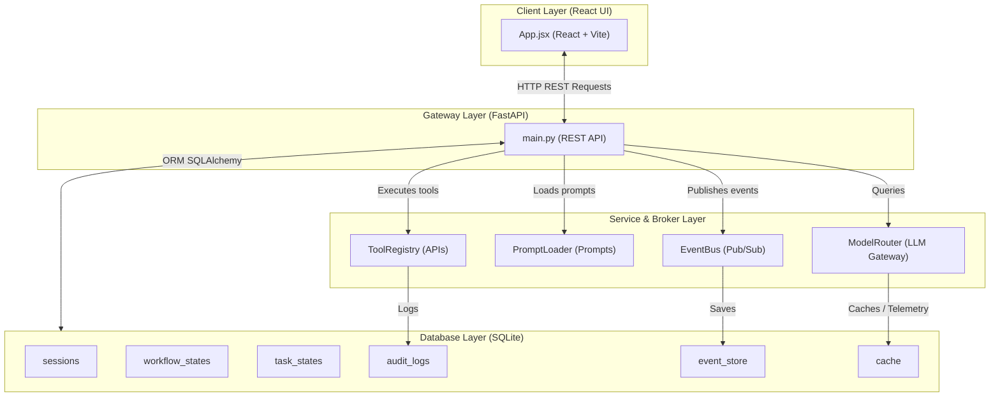

# TravelOps AI — Phase 1: Core Platform Infrastructure Documentation

This document contains a comprehensive breakdown of the files, classes, methods, and functions created during **Phase 1: Core Platform Infrastructure**. This phase establishes the foundation of the event-driven multi-agent travel operations platform, including the database, LLM gateway, prompt registry, event bus, tool registry, REST API routes, and the React frontend.

---

## System Architecture

The blueprint below represents the system architecture of the Phase 1 Core Infrastructure, showcasing the interaction between the React Client UI, the FastAPI Gateway, core services, and the relational database models.

---

## 1. Directory & File Overview

The Phase 1 codebase is organized as follows:

| File Path | Description |
| :--- | :--- |
| [`backend/database/db.py`](file:///d:/TravelOps%20AI%20%E2%80%93%20Autonomous%20Travel%20Operations%20Agent/backend/database/db.py) | Establishes SQLite engine configuration and session provider functions. |
| [`backend/database/models.py`](file:///d:/TravelOps%20AI%20%E2%80%93%20Autonomous%20Travel%20Operations%20Agent/backend/database/models.py) | Declares ORM models for workflow sessions, task states, audit logs, event stores, and caching. |
| [`backend/services/llm.py`](file:///d:/TravelOps%20AI%20%E2%80%93%20Autonomous%20Travel%20Operations%20Agent/backend/services/llm.py) | Integrates the Groq API client, routes queries to Llama3 models, and gathers telemetry. |
| [`backend/services/prompt_loader.py`](file:///d:/TravelOps%20AI%20%E2%80%93%20Autonomous%20Travel%20Operations%20Agent/backend/services/prompt_loader.py) | Loads prompt templates from `/prompts` and replaces double-curly bracket placeholders. |
| [`backend/events/event_bus.py`](file:///d:/TravelOps%20AI%20%E2%80%93%20Autonomous%20Travel%20Operations%20Agent/backend/events/event_bus.py) | Implements an asynchronous pub-sub broker that persists events in the database Event Store. |
| [`backend/tools/registry.py`](file:///d:/TravelOps%20AI%20%E2%80%93%20Autonomous%20Travel%20Operations%20Agent/backend/tools/registry.py) | Establishes the Base Tool structure and registers custom tools with database-level auditing. |
| [`backend/api/main.py`](file:///d:/TravelOps%20AI%20%E2%80%93%20Autonomous%20Travel%20Operations%20Agent/backend/api/main.py) | Serves as the primary REST gateway hosting endpoints and mock agent logic. |
| [`frontend/src/App.jsx`](file:///d:/TravelOps%20AI%20%E2%80%93%20Autonomous%20Travel%20Operations%20Agent/frontend/src/App.jsx) | A dashboard UI displaying active session conversations, system metrics, and execution graphs. |

---

## 2. Database Connection Management

### File: [`backend/database/db.py`](file:///d:/TravelOps%20AI%20%E2%80%93%20Autonomous%20Travel%20Operations%20Agent/backend/database/db.py)
This file handles connection parameters for the SQLite relational store.

#### Global Objects:
* `DATABASE_URL`: Resolves SQLite location, default is `sqlite:///./travelops.db`.
* `engine`: SQLAlchemy Engine instance configured with `check_same_thread=False` to handle multi-threaded FastAPI requests.
* `SessionLocal`: Session factory to construct individual SQLAlchemy database connection handles.
* `Base`: Declarative base class mapping Python classes to SQL tables.

#### Functions:
* **`init_db()`**
  * **Role:** Triggers schema generation.
  * **What it does:** Imports `backend.database.models` to register subclasses of `Base`, then calls `Base.metadata.create_all` to build missing tables in SQLite.

---

## 3. Relational Schemas & Entities

### File: [`backend/database/models.py`](file:///d:/TravelOps%20AI%20%E2%80%93%20Autonomous%20Travel%20Operations%20Agent/backend/database/models.py)
Declares database tables mapping agent states, execution trees, and logs.

### Classes & Methods:

#### 1. `SessionModel`
* **Table:** `sessions`
* **Role:** Tracks active/inactive passenger-operator workspace contexts.
* **Fields:** `session_id` (String PK), `created_at` (DateTime), `updated_at` (DateTime).

#### 2. `WorkflowStateModel`
* **Table:** `workflow_states`
* **Role:** Holds state machines for user journeys.
* **Fields:** `id` (Integer PK), `session_id` (String Index), `state` (String: e.g., `NEW`, `SEARCHING`, `OPTIONS_FOUND`, `BOOKING`, `MONITORING`), `updated_at` (DateTime).

#### 3. `TaskStateModel`
* **Table:** `task_states`
* **Role:** Represents a single execution node in the DAG Orchestration Graph.
* **Fields:** `id` (Integer PK), `session_id` (String Index), `task_id` (String), `name` (String), `status` (String: `PENDING`, `RUNNING`, `COMPLETED`, `FAILED`), `dependencies_raw` (Text), `input_raw` (Text), `output_raw` (Text), `created_at` (DateTime), `updated_at` (DateTime).
* **Methods:**
  * `set_dependencies(dependencies: List[str])`: Serializes a list of dependent `task_id` values to JSON string.
  * `get_dependencies() -> List[str]`: Deserializes raw text back to a list of strings.
  * `set_input(input_data: Dict[str, Any])`: Serializes input parameters to JSON.
  * `get_input() -> Dict[str, Any]`: Retrieves input parameters as a dictionary.
  * `set_output(output_data: Dict[str, Any])`: Serializes execution results to JSON.
  * `get_output() -> Dict[str, Any]`: Retrieves execution results as a dictionary.

#### 4. `AuditLogModel`
* **Table:** `audit_logs`
* **Role:** Stores trace events, LLM reasoning thoughts, user messages, and tool invocations.
* **Fields:** `id` (Integer PK), `session_id` (String Index), `agent_name` (String), `action` (String), `reasoning_summary` (Text), `payload_raw` (Text), `created_at` (DateTime).
* **Methods:**
  * `set_payload(payload: Dict[str, Any])`: Serializes structured event details to JSON.
  * `get_payload() -> Dict[str, Any]`: Deserializes payload data.

#### 5. `EventStoreModel`
* **Table:** `event_store`
* **Role:** Stores event records published to the `EventBus` for historical replay and auditing.
* **Fields:** `id` (String PK - UUID), `event_type` (String), `session_id` (String Index), `payload_raw` (Text), `timestamp` (DateTime).
* **Methods:**
  * `set_payload(payload: Dict[str, Any])`: Serializes event parameters to JSON.
  * `get_payload() -> Dict[str, Any]`: Deserializes event parameters.

#### 6. `CacheModel`
* **Table:** `cache`
* **Role:** Key-value store for caching search queries and LLM results.
* **Fields:** `key` (String PK), `value` (Text JSON), `expires_at` (DateTime).

---

## 4. LLM & Model Router Gateway

### File: [`backend/services/llm.py`](file:///d:/TravelOps%20AI%20%E2%80%93%20Autonomous%20Travel%20Operations%20Agent/backend/services/llm.py)
This module acts as the router to external LLMs. It maps semantic capability requests to appropriate models using the Groq API.

### Classes & Methods:

#### `ModelRouter`
* **Class Attributes:**
  * `CAPABILITY_MAP`: Maps abstract task requirements to models:
    * `"reasoning"` ➔ `"llama3-70b-8192"` (High accuracy reasoning engine)
    * `"fast"` ➔ `"llama3-8b-8192"` (Low latency token generator)
  * `DEFAULT_CAPABILITY`: Set to `"fast"`.
* **Methods:**
  * **`__init__(api_key: Optional[str] = None)`**
    * **Role:** Initializes the client.
    * **What it does:** Looks up `GROQ_API_KEY` from system environment or arguments, instantiates a `Groq` connection, and sets up an empty list `metrics_log` to keep track of request metrics.
  * **`generate(messages: List[Dict[str, str]], capability: str, temperature: float, response_format: Optional[Dict], max_tokens: Optional[int]) -> Dict[str, Any]`**
    * **Role:** Invokes the targeted LLM model.
    * **What it does:** Resolves capability model type, measures execution time, and triggers `client.chat.completions.create`. On success, records tokens used, log response details in `metrics_log`, and returns a dictionary payload containing completion content. If error occurs, writes error logs and returns error payload.
  * **`get_metrics() -> List[Dict[str, Any]]`**
    * **Role:** Returns metrics.
    * **What it does:** Exposes the in-memory array of request timings and token counts for dashboard observability.

---

## 5. Prompt Registry Loader

### File: [`backend/services/prompt_loader.py`](file:///d:/TravelOps%20AI%20%E2%80%93%20Autonomous%20Travel%20Operations%20Agent/backend/services/prompt_loader.py)
Handles separating prompt instructions from the Python codebase by loading markdown prompt files.

### Classes & Methods:

#### `PromptLoader`
* **Methods:**
  * **`__init__(prompts_dir: str = None)`**
    * **Role:** Configures prompt directories.
    * **What it does:** Computes project root `/prompts` folder if no custom override directory is provided.
  * **`load_prompt(name: str, variables: Dict[str, Any] = None) -> str`**
    * **Role:** Reads markdown templates and formats arguments.
    * **What it does:** Cleans prompt filename, verifies file exists, opens with `utf-8` encoding, and replaces matching prompt parameters enclosed in double curly brackets `{{variable_name}}` with variables passed.

---

## 6. Pub-Sub Event Bus

### File: [`backend/events/event_bus.py`](file:///d:/TravelOps%20AI%20%E2%80%93%20Autonomous%20Travel%20Operations%20Agent/backend/events/event_bus.py)
Implements an asynchronous pub-sub dispatcher for decoupled multi-agent communications.

### Classes & Methods:

#### `EventBus`
* **Class Attributes:**
  * `_subscribers`: A dictionary mapping event type strings to lists of async subscriber callbacks.
  * `_lock`: An `asyncio.Lock` instance to prevent race conditions during subscriber registration.
* **Methods:**
  * **`subscribe(cls, event_type: str, callback: Callable) [classmethod]`**
    * **Role:** Registers an async listener callback.
    * **What it does:** Acquires the concurrency lock and appends the callback function to the array corresponding to the event type.
  * **`publish(cls, event_type: str, session_id: str, payload: Dict[str, Any]) [classmethod]`**
    * **Role:** Propagates events to listeners.
    * **What it does:**
      1. Generates a new UUID.
      2. Creates an `EventStoreModel`, serializes the payload, and saves the record in SQLite database.
      3. Retrieves registered callback handlers for `event_type`.
      4. Wraps each callback execution in an isolated try-except handler (preventing cascading failures) and runs them concurrently using `asyncio.gather`.

---

## 7. Tool Auditing & Registration

### File: [`backend/tools/registry.py`](file:///d:/TravelOps%20AI%20%E2%80%93%20Autonomous%20Travel%20Operations%20Agent/backend/tools/registry.py)
This module regulates how Python functions interface as agent tools, auditing every action in the database.

### Classes & Methods:

#### 1. `BaseTool` (Abstract Base Class)
* **Properties:**
  * `name`: Abstract unique string identifying tool.
  * `description`: Abstract description detail specifying inputs.
* **Methods:**
  * `execute(session_id: str, **kwargs) -> Dict[str, Any]`: Abstract method containing core task logic.

#### 2. `ToolRegistry`
* **Class Attributes:**
  * `_registry`: Dictionary storing tool names linked to `BaseTool` instances.
* **Methods:**
  * **`register(cls, tool_instance: BaseTool) [classmethod]`**
    * **Role:** Stores a tool instance.
  * **`get_tool(cls, name: str) -> BaseTool [classmethod]`**
    * **Role:** Retrieves tool from registry by name. Throws `KeyError` if tool is missing.
  * **`list_tools(cls) -> List[Dict[str, str]] [classmethod]`**
    * **Role:** Returns details (name, description) of registered tools.
  * **`execute_tool(cls, name: str, session_id: str, **kwargs) -> Dict[str, Any] [classmethod]`**
    * **Role:** Audits and executes tool.
    * **What it does:** Locates tool instance, writes an initial `AuditLogModel` indicating a tool call started with the inputs, executes the tool under a try-catch block, calculates latency, updates the audit log entry with output details or error logs, commits the database session, and returns the results.

#### Functions:
* **`register_tool(cls: Type[BaseTool])`**
  * **Role:** Class decorator.
  * **What it does:** Instantiates the decorated class and registers it directly with `ToolRegistry`.

---

## 8. Web API Gateway

### File: [`backend/api/main.py`](file:///d:/TravelOps%20AI%20%E2%80%93%20Autonomous%20Travel%20Operations%20Agent/backend/api/main.py)
Exposes FastAPI routes for sessions, messages, tool execution, and metrics.

### Functions & Handlers:

* **`startup_event()`**
  * **Role:** Startup handler.
  * **What it does:** Initializes database models inside SQLite database on application start.
* **`get_db()`**
  * **Role:** Database dependency provider.
  * **What it does:** Opens a new `SessionLocal` database connection and yields it, guaranteeing the connection is closed when the HTTP request completes.
* **`to_iso_utc(dt: datetime)`**
  * **Role:** Formatting helper.
  * **What it does:** Formats naive datetimes into ISO-8601 strings ending with `"Z"` (UTC) for consistent client display.
* **`health_check()`**
  * **Route:** `GET /health`
  * **What it does:** Validates service status and checks if the LLM API key environment variable is configured.
* **`create_session(session_req: SessionCreate, db: Session)`**
  * **Route:** `POST /api/sessions`
  * **What it does:** Generates session IDs if not supplied, verifies duplication, inserts new `SessionModel` and `WorkflowStateModel` (state set to `NEW`), adds audit trace log, commits transaction, and returns status details.
* **`list_sessions(db: Session)`**
  * **Route:** `GET /api/sessions`
  * **What it does:** Queries and returns a sorted list of session objects.
* **`get_session_details(session_id: str, db: Session)`**
  * **Route:** `GET /api/sessions/{session_id}`
  * **What it does:** Queries and returns session details including workflow state, task graph lists, and conversation audit logs (user and assistant messages).
* **`send_message(session_id: str, req: MessageRequest, db: Session)`**
  * **Route:** `POST /api/sessions/{session_id}/message`
  * **What it does:**
    1. Saves the User message to audit log database.
    2. Runs the Intent Agent (via LLM router, falling back to keyword parse helper `mock_intent_parser` if Groq credentials are unset) to categorize user intent.
    3. Persists intent results to audit log and updates session workflow state.
    4. If the intent matches `search_bus`, runs the Planner Agent (or `mock_planner` fallback) to generate a task dependency graph DAG, deletes old session tasks, and writes the new tasks to database in `PENDING` state.
    5. If intent is chat, runs support prompt framework.
    6. Appends assistant response to database audit logs and returns results.
* **`list_registered_tools()`**
  * **Route:** `GET /api/tools`
  * **What it does:** Queries `ToolRegistry` and lists all registered tools.
* **`execute_session_task(session_id: str, req: ExecuteTaskRequest, db: Session)`**
  * **Route:** `POST /api/sessions/{session_id}/execute-task`
  * **What it does:** Executes a tool through `ToolRegistry` and returns the audited result.
* **`publish_event(req: PublishEventRequest)`**
  * **Route:** `POST /api/events/publish`
  * **What it does:** Publishes custom payloads to the `EventBus`.
* **`get_observability_metrics()`**
  * **Route:** `GET /api/observability/metrics`
  * **What it does:** Returns current LLM metrics log (latency, tokens) and tool count metrics.
* **`mock_intent_parser(message: str, current_date: str) -> Dict`**
  * **Role:** Fallback keyword parser.
  * **What it does:** Uses regex/string analysis to parse locations, travel dates, PNR codes, and matches intents like `search_bus`, `book_bus`, `cancel_bus`, `monitor_journey`.
* **`mock_planner(entities: Dict) -> Dict`**
  * **Role:** Fallback task graph planner.
  * **What it does:** Returns a default list of tasks (`search_buses` ➔ `recommend_options` ➔ `hold_seat` ➔ `process_payment` ➔ `confirm_booking` ➔ `send_notification`) with dependencies based on route entities.

---

## 9. Frontend Console Dashboard

### File: [`frontend/src/App.jsx`](file:///d:/TravelOps%20AI%20%E2%80%93%20Autonomous%20Travel%20Operations%20Agent/frontend/src/App.jsx)
Builds the user interface console layout to drive conversation and display execution flow graphs.

### Core States:
* `sessions`: Stores history list of active chat sessions.
* `currentSessionId`: Keeps track of the current focused session ID.
* `sessionDetails`: Holds current session object, including workflow state, task list, and chat conversation log.
* `inputValue`: Binds user text in the chat input field.
* `metrics`: Observability data including total agent calls, latency, and tokens.
* `isSending` / `isSimulating`: Interactive load locks to prevent parallel requests.

### Core Handler Functions:
* **`fetchSessions()`**
  * **Role:** Re-fetches the conversation session history.
  * **What it does:** Issues a GET request to `/api/sessions` and updates the `sessions` state.
* **`fetchSessionDetails(sessionId)`**
  * **Role:** Updates active screen views.
  * **What it does:** Issues a GET request to `/api/sessions/{session_id}` to retrieve active conversation logs, workflow state, and generated execution tasks.
* **`fetchMetrics()`**
  * **Role:** Populates system telemetry metrics.
  * **What it does:** Issues a GET request to `/api/observability/metrics`, aggregates latency values and total tokens, and updates the `metrics` state.
* **`handleNewSession()`**
  * **Role:** Creates new conversation spaces.
  * **What it does:** Triggers a POST to `/api/sessions` and switches focus to the new session ID.
* **`handleSendMessage(e)`**
  * **Role:** Submits user text.
  * **What it does:** Optimistically updates the conversation state with the user message, clears the text input field, triggers POST `/api/sessions/{session_id}/message`, and updates session details and metrics.
* **`handleSimulateExecution()`**
  * **Role:** Runs frontend animation sequence for the orchestrator task graph.
  * **What it does:** Loops through the tasks in the task graph, setting each task's status state to `'RUNNING'` and then `'COMPLETED'` after a 1200ms delay.
* **Lifecycle Effects:**
  * **Initial poll:** Triggers initial fetches and configures a 5-second polling interval to refresh telemetry metrics.
  * **Session watch:** Refreshes details whenever `currentSessionId` updates.
  * **Auto scroll:** Scrolls chat to the bottom whenever conversation messages update.
