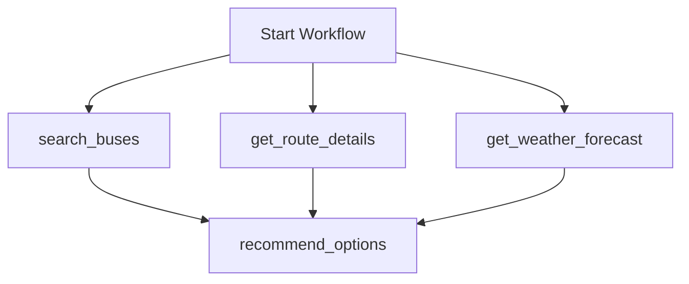

# Phase 10: Real Integrations & DX Package (v2.0 Production Release)

This phase establishes the production-grade integration and developer experience (DX) enhancements for **TravelOps AI v2.0**. It replaces mock modules with real external HTTP services (Google Maps & Open-Meteo), scales the notifications gateway to connect to SMTP servers and Twilio endpoints, namespacing idempotency keys to permit multi-transaction sessions, and exposes a comprehensive terminal demo scenario CLI runner.

---

## 1. Real-World API Services & Integrations

The system utilizes a **hybrid adapter pattern** to integrate external APIs, providing live connectivity while retaining seamless, zero-config mock fallbacks.

### A. Maps Service & Geodistance Solver
* **API Route**: Connects to the **Google Distance Matrix API** if an active `GOOGLE_MAPS_API_KEY` is present.
* **Deterministic Fallback**: In the absence of an API key or upon network failure, the service automatically initiates a **Haversine Geodistance Model** to calculate geographic route approximations between major hubs (Bangalore, Hyderabad, Delhi, Jaipur, Mumbai, Pune).
* **Reference**: [maps.py](file:///d:/TravelOps%20AI%20%E2%80%93%20Autonomous%20Travel%20Operations%20Agent/backend/services/maps.py)

### B. Weather Forecast Service
* **API Route**: Performs live JSON REST queries to the public **Open-Meteo API** to fetch real-time temperatures and meteorological weather condition codes.
* **Fallback**: Employs a deterministic mock forecast engine if API requests fail or are rate-limited, ensuring execution flows continue without interruption.
* **Reference**: [weather.py](file:///d:/TravelOps%20AI%20%E2%80%93%20Autonomous%20Travel%20Operations%20Agent/backend/services/weather.py)

### C. Upgraded Notifications Gateway
* **SMTP Email**: Leverages standard Python `smtplib` and `ssl` context to connect to secure external mail hosts (e.g. Gmail App Passwords, SendGrid host servers) on port `587` (STARTTLS) or `465` (SSL).
* **Twilio SMS & WhatsApp**: Utilizes basic HTTP authentication headers to post message payloads directly to Twilio REST endpoints, automatically prefixing WhatsApp target formats.
* **Reference**: [notification.py](file:///d:/TravelOps%20AI%20%E2%80%93%20Autonomous%20Travel%20Operations%20Agent/backend/services/notification.py)

---

## 2. Idempotency Key Namespacing

To prevent task collision within a single session (where multiple tasks like payment and confirmation share the same session-wide idempotency key), the tools now namespace keys under unique prefixes:
* **Payment Tool**: Checks and caches under `idem:payment:<idempotency_key>`.
* **Confirmation Tool**: Checks and caches under `idem:confirm:<idempotency_key>`.

This namespacing ensures that the confirmation step executes fully rather than fetching a false-positive cached result from the preceding payment step.

---

## 3. Workflow DSL & Registry Updates

Two new tools are registered in the global registry and integrated into the workflow compiler templates to execute lookups in parallel with the initial bus search query:



### Registered Tools
* `get_route_details`: Arguments: `origin` (str), `destination` (str). Retrieves travel distance and time metrics.
* `get_weather_forecast`: Arguments: `destination` (str), `travel_date` (str). Fetches temperature and outlook.
* **Reference**: [travel_tools.py](file:///d:/TravelOps%20AI%20%E2%80%93%20Autonomous%20Travel%20Operations%20Agent/backend/tools/travel_tools.py)

---

## 4. Developer DX Scenario CLI Tool

We created [demo_scenarios.py](file:///d:/TravelOps%20AI%20%E2%80%93%20Autonomous%20Travel%20Operations%20Agent/demo_scenarios.py) at the project root folder. It provides an interactive command line interface (with automated argument options for non-interactive CI environments) to execute:
1. **Normal Booking Flow**: Runs parallel search, weather, maps, hold seat, payment, PNR confirmation, and notifications.
2. **Payment Decline & Saga Rollback**: Triggers invalid Luhn card transaction failure, aborting confirmation and executing database seat hold rollbacks.
3. **Disruption Recovery Flow**: Simulates a bus cancellation event, invoking the Journey Monitor to mark the state as disrupted and triggering the Recovery Agent to autonomously rebook the traveler on the best alternative operator based on memory preferences.

---

## 5. Verification Results

All unit tests and integration scenarios pass successfully:

### A. Integration Test Suite
```powershell
.venv/Scripts/python -m unittest tests/test_integrations.py
```
* **Result**: `OK` (9/9 tests passed).
  - Validates API response formats, HTTP failures, SMTP logins, and Twilio REST posts.

### B. Full Test Suite Discovery
```powershell
.venv/Scripts/python -m unittest discover -s tests -p "test_*.py"
```
* **Result**: `OK` (47/47 tests passed).

### C. CLI Scenario Validation
All scenarios execute successfully, logging states in `travelops.db` and outputting progress metrics:
```powershell
.venv/Scripts/python demo_scenarios.py all
```
* **Status Matrix Results**:
  - **Scenario 1**: All 8 tasks (`COMPLETED`), PNR code successfully generated.
  - **Scenario 2**: `process_payment` (`FAILED`), Saga rollback releases seat from inventory.
  - **Scenario 3**: Bus cancelled, passenger rebooked autonomously on alternative carrier.
