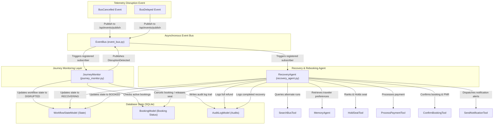

# TravelOps AI — Phase 4: Autonomous Operations (Event-Driven) Documentation

This document contains a comprehensive breakdown of the files, classes, methods, and functions created during **Phase 4: Autonomous Operations (Event-Driven)**. In this phase, we shifted TravelOps AI from a user-triggered sequential workflow to an autonomous, event-driven operations manager. It monitors journey disruptions (like bus cancellations or delays) in real-time, schedules automation alerts/polling jobs, computes business policies for refunds/claims, coordinates recovery agent alternate seat matches, and personalizes rebookings using traveler preferences.

---

## System Architecture

The workflow diagram below represents the event-driven autonomous monitoring and recovery architecture implemented in Phase 4, showing how telemetry disruption events are caught by the Journey Monitor, logged in SQLite, and resolved by the Recovery Agent via the concurrent tool registry:

---

## 1. Directory & File Overview

The new and modified files in Phase 4 include:

| File Path | Description |
| :--- | :--- |
| [`backend/services/scheduler.py`](file:///d:/TravelOps%20AI%20%E2%80%93%20Autonomous%20Travel%20Operations%20Agent/backend/services/scheduler.py) | **[New]** Created the native `JobScheduler` utility class using asyncio. |
| [`agents/monitor/journey_monitor.py`](file:///d:/TravelOps%20AI%20%E2%80%93%20Autonomous%20Travel%20Operations%20Agent/agents/monitor/journey_monitor.py) | **[New]** Created the `JourneyMonitor` class to intercept bus disruptions. |
| [`agents/recovery/recovery_agent.py`](file:///d:/TravelOps%20AI%20%E2%80%93%20Autonomous%20Travel%20Operations%20Agent/agents/recovery/recovery_agent.py) | **[New]** Created the `RecoveryAgent` class to orchestrate rebooking recovery workflows. |
| [`backend/tools/travel_tools.py`](file:///d:/TravelOps%20AI%20%E2%80%93%20Autonomous%20Travel%20Operations%20Agent/backend/tools/travel_tools.py) | **[Modified]** Updated `HoldSeatTool` to dynamically find the first available seat on a bus run if `seat_number` is omitted. |
| [`backend/api/main.py`](file:///d:/TravelOps%20AI%20%E2%80%93%20Autonomous%20Travel%20Operations%20Agent/backend/api/main.py) | **[Modified]** Registered the background EventBus subscriptions for `BusCancelled`, `BusDelayed`, and `DisruptionDetected` on application startup. |
| [`frontend/src/index.css`](file:///d:/TravelOps%20AI%20%E2%80%93%20Autonomous%20Travel%20Operations%20Agent/frontend/src/index.css) | **[Modified]** Added glassmorphism badge styles for `.state-badge.disrupted` and `.state-badge.recovering`. |
| [`tests/test_phase4.py`](file:///d:/TravelOps%20AI%20%E2%80%93%20Autonomous%20Travel%20Operations%20Agent/tests/test_phase4.py) | **[New]** Created the Phase 4 unit testing suite. |

---

## 2. Job Scheduler Service

### File: [`backend/services/scheduler.py`](file:///d:/TravelOps%20AI%20%E2%80%93%20Autonomous%20Travel%20Operations%20Agent/backend/services/scheduler.py)
Provides a native, lightweight, non-blocking scheduler to schedule background jobs asynchronously.

#### Classes & Methods:
* **`JobScheduler`**
  * **Role:** Manages deferred callback tasks.
  * **Methods:**
    * `schedule_once(job_id: str, delay_seconds: float, func: Callable, *args, **kwargs)`: Schedules a function callback inside the active event loop, cancelling any existing job with the same ID first.
    * `cancel_job(job_id: str)`: Cancels active, uncompleted scheduled tasks and removes them from the tracking dictionary.

---

## 3. Journey Monitoring Agent

### File: [`agents/monitor/journey_monitor.py`](file:///d:/TravelOps%20AI%20%E2%80%93%20Autonomous%20Travel%20Operations%20Agent/agents/monitor/journey_monitor.py)
Subscribes to operational telemetry event streams, identifies impacted passenger bookings, and flags disruptions.

#### Classes & Methods:
* **`JourneyMonitor`**
  * **Role:** Intercepts journey delay and cancellation alerts.
  * **Methods:**
    * `handle_bus_cancelled(session_id: str, payload: Dict[str, Any]) [classmethod]`: Triggered on `BusCancelled`. Verifies if the cancelled bus ID matches any active booking in SQLite for the session. If matched, updates session workflow state to `DISRUPTED`, logs audit context, and publishes a `DisruptionDetected` event.
    * `handle_bus_delayed(session_id: str, payload: Dict[str, Any]) [classmethod]`: Triggered on `BusDelayed`. Verifies delay bounds; if the delay exceeds 120 minutes, transitions state to `DISRUPTED` and publishes `DisruptionDetected`.

---

## 4. Autonomous Recovery Agent

### File: [`agents/recovery/recovery_agent.py`](file:///d:/TravelOps%20AI%20%E2%80%93%20Autonomous%20Travel%20Operations%20Agent/agents/recovery/recovery_agent.py)
Subscribes to internal disruption events and coordinates re-planning and re-booking processes autonomously.

#### Classes & Methods:
* **`RecoveryAgent`**
  * **Role:** Orchestrates the rebooking recovery sequence.
  * **Methods:**
    * `handle_disruption(session_id: str, payload: Dict[str, Any]) [classmethod]`:
      1. Transitions the session workflow state to `RECOVERING`.
      2. Releases the old seat, sets status to `CANCELLED`, and logs a 100% refund claim due to operator disruption.
      3. Queries alternative routes on same travel dates using `SearchBusTool`.
      4. Pulls passenger preferences using `MemoryAgent`.
      5. Ranks alternatives and executes `HoldSeatTool` to reserve a new seat dynamically.
      6. Executes `ProcessPaymentTool` and `ConfirmBookingTool` to confirm the new booking and generate a new PNR.
      7. Dispatches passenger rebooking alerts using `SendNotificationTool` and sets session state back to `BOOKED`.

---

## 5. Gateway Endpoints & Server Hooks

### File: [`backend/api/main.py`](file:///d:/TravelOps%20AI%20%E2%80%93%20Autonomous%20Travel%20Operations%20Agent/backend/api/main.py)
Hooks event subscribers to startup cycles.

#### Key Changes:
* **Startup Subscriptions:** Updated `startup_event()` to bind `JourneyMonitor.handle_bus_cancelled` (to `"BusCancelled"`), `JourneyMonitor.handle_bus_delayed` (to `"BusDelayed"`), and `RecoveryAgent.handle_disruption` (to `"DisruptionDetected"`) on the event bus when uvicorn initializes.

---

## 6. Verification & Testing Suite

### File: [`tests/test_phase4.py`](file:///d:/TravelOps%20AI%20%E2%80%93%20Autonomous%20Travel%20Operations%20Agent/tests/test_phase4.py)
Validates Phase 4 features under isolated conditions.

#### Test Cases:
* `test_job_scheduler()`: Asserts that one-off callbacks execute after specified delays, and cancel actions prevent scheduled executions.
* `test_journey_monitor_cancellation()`: Seeds booking details, invokes the monitor cancellation trigger, and verifies workflow state shifts to `DISRUPTED` and fires the alert event.
* `test_recovery_agent_rebooking()`: Seeds booking and search task parameters, executes recovery rebooking processes, and asserts that the previous ticket is cancelled, refund is logged, a new alternative bus is confirmed, a new PNR code is generated, and the final state reaches `BOOKED`.
