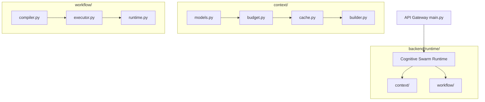

# Phase 9: Swarm AI Runtime & Restructuring (v2.0 Production)

This phase establishes the production-ready restructuring and capabilities for **TravelOps AI v2.0**. It decouples cognitive swarm operations from basic middleware and introduces core enterprise runtime controls: versioning, time-to-live leases, explainability maps, dynamic agent budgets, step-level timeouts/retries, and human-in-the-loop task approvals with compensating Sagas rollback triggers.

---

## 1. Architectural Reorganization

Cognitive runtime operation layers are clean, versionable, and modular:



### Decoupled Code Layout
* [models.py](file:///d:/TravelOps%20AI%20%E2%80%93%20Autonomous%20Travel%20Operations%20Agent/backend/runtime/context/models.py): Defines `ContextFragment` and `ContextBundle` with version tracking, expires leases, and secure SHA-256 caching hashes.
* [budget.py](file:///d:/TravelOps%20AI%20%E2%80%93%20Autonomous%20Travel%20Operations%20Agent/backend/runtime/context/budget.py): Implements the sliding budget selector with dynamic allocations:
  - `intent`: 2,500 tokens
  - `support`: 6,000 tokens
  - `planner`: 12,000 tokens
  - `reflection`: 10,000 tokens
* [cache.py](file:///d:/TravelOps%20AI%20%E2%80%93%20Autonomous%20Travel%20Operations%20Agent/backend/runtime/context/cache.py): Handles lookup lease validity checkups and deletes expired bundles.
* [builder.py](file:///d:/TravelOps%20AI%20%E2%80%93%20Autonomous%20Travel%20Operations%20Agent/backend/runtime/context/builder.py): Coordinates dynamic fragments fitting, guardrails masking, and exposes the `AIRuntime` coordinate class.
* [compiler.py](file:///d:/TravelOps%20AI%20%E2%80%93%20Autonomous%20Travel%20Operations%20Agent/backend/runtime/workflow/compiler.py): Parses node-level parameters (`timeout`, `retry`, `parallel`, `approval_required`, `rollback`) from YAML templates.
* [executor.py](file:///d:/TravelOps%20AI%20%E2%80%93%20Autonomous%20Travel%20Operations%20Agent/backend/runtime/workflow/executor.py): Schedules task execution waves, manages step-level execution timeouts, handles retries, and invokes self-repair.
* [runtime.py](file:///d:/TravelOps%20AI%20%E2%80%93%20Autonomous%20Travel%20Operations%20Agent/backend/runtime/workflow/runtime.py): Exposes manual operator approvals and triggers compensating Saga rollbacks upon failure.

---

## 2. Dynamic Budgeting & Explainability Mappings

The context builder allocates budgets dynamically by matching target agents. Pruned or truncated segments due to limits are tracked inside the `explainability` dictionary:

```python
explainability = {
    "system": "Required rules and operational directives for the support agent.",
    "history": "Working memory logs of the previous 4 conversation turns.",
    "policy": "Pruned/Clipped due to token budget bounds (Limit: 6000 tokens)."
}
```

---

## 3. Human-in-the-Loop & Saga Compensations

1. **Human Gate**: Tasks marked with `approval_required: true` shift to `PAUSED` state. The session state changes to `APPROVAL_REQUIRED` until operators trigger the `/api/sessions/{session_id}/approve` endpoint.
2. **Saga Rollback**: When task retries and reflection self-repair attempts are exhausted, the executor initiates compensating rollbacks:
   - Reverts seat holds by changing status to `CANCELLED` and incrementing the bus run inventory available seats.

---

## 4. Verification Results

All 38 test suites pass cleanly:
```powershell
.venv/Scripts/python -m unittest discover -s tests -p "test_*.py"
```
* **Result**: `OK` (38/38 tests passed)
  - `tests/test_runtime_context.py` checks cache leases, dynamic bounds, and SHA-256 hashes.
  - `tests/test_runtime_workflow.py` checks metadata compiler configs, retry timeouts, human gates, and Sagas rollback.
