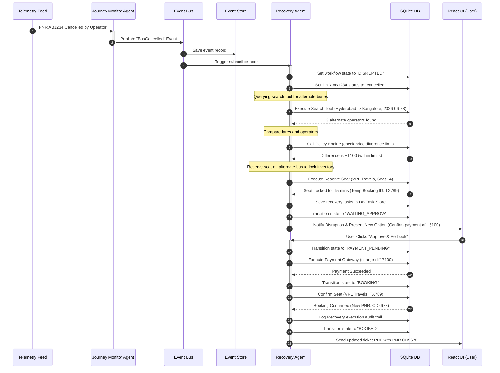

# Workflow Design Document (WDD) - TravelOps AI

This document details the mechanics of the Workflow Engine, State Machine transitions, Task Dependency Graphs, and the event-driven sequence flows that govern TravelOps AI.

---

## 1. Workflow State Machine Mechanics

The Workflow Engine manages session execution states. The current state is updated in the database `workflow_states` table.

```
       ┌───────┐
       │  NEW  │
       └───┬───┘
           │ Intent Parsing
           ▼
  ┌─────────────────┐
  │  INTENT_PARSED  │
  └────────┬────────┘
           │
     ┌─────┴──────────────┐
     ▼ Search             ▼ Cancel
┌───────────┐       ┌───────────┐
│ SEARCHING │       │ CANCELLED │
└─────┬─────┘       └───────────┘
      │ Matches found
      ▼
┌───────────────┐
│ OPTIONS_FOUND │
└─────┬─────────┘
      │ Select & Reserve
      ▼
┌──────────────────┐
│ WAITING_APPROVAL │
└─────┬────────────┘
      │ User Approved
      ▼
┌─────────────────┐
│ PAYMENT_PENDING │
└─────┬───────────┘
      │ Success
      ▼
┌───────────┐
│  BOOKING  │
└─────┬─────┘
      │ PNR Issued
      ▼
┌───────────┐
│  BOOKED   │
└─────┬─────┘
      │ Monitor Initiated
      ▼
┌──────────────┐
│  MONITORING  ├────────────────────────┐
└─────┬────────┘                        │
      │ Journey Complete                │ Disruption detected
      ▼                                 ▼
┌───────────────┐              ┌─────────────────┐
│   COMPLETED   │              │    DISRUPTED    │
└───────────────┘              └────────┬────────5
                                        │ Recovery active
                                        ▼
                               ┌─────────────────┐
                               │   RECOVERING    │
                               └────────┬────────┘
                                        │ Re-booked & Confirmed
                                        ▼
                               ┌─────────────────┐
                               │     BOOKED      │
                               └─────────────────┘
```

---

## 2. Task Dependency Graph Structure

The Planner Agent generates tasks as a Directed Acyclic Graph (DAG). The Workflow Engine executes these tasks in order of their dependencies.

```json
{
  "session_id": "session_8899aacc",
  "tasks": [
    {
      "id": "task_search_01",
      "name": "SearchBuses",
      "dependencies": [],
      "status": "completed",
      "input_data": {
        "origin": "Hyderabad",
        "destination": "Bangalore",
        "date": "2026-06-28"
      },
      "output_data": {
        "buses_found": 12
      }
    },
    {
      "id": "task_recommend_01",
      "name": "RankRecommendations",
      "dependencies": ["task_search_01"],
      "status": "pending",
      "input_data": {},
      "output_data": {}
    },
    {
      "id": "task_notify_01",
      "name": "SendSearchReport",
      "dependencies": ["task_recommend_01"],
      "status": "pending",
      "input_data": {},
      "output_data": {}
    }
  ]
}
```

---

## 3. Disruption Recovery Sequence Flow (Sequence Diagram)

Below is the execution flow when a bus cancellation event triggers the autonomous recovery loop:


