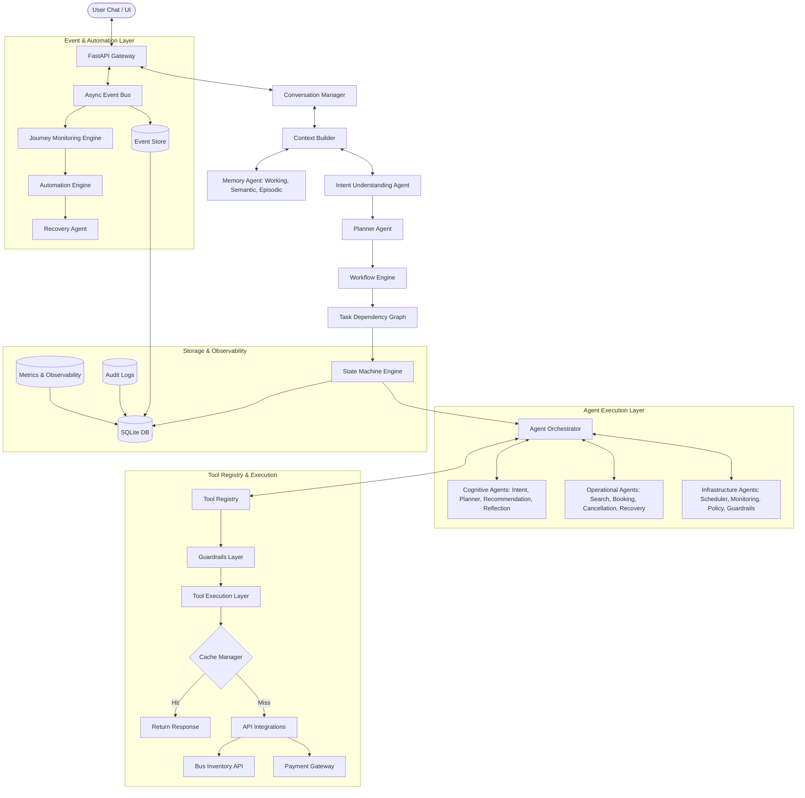

# TravelOps AI – Autonomous Travel Operations Platform

TravelOps AI is a production-grade, workflow-centric travel operations platform. Designed as an AI Operating System for Travel, it continuously monitors bookings, dynamically generates task dependency graphs, resolves disruptions, caches API responses, and routes tasks to specialized cognitive, operational, and infrastructure agents.

---

## 7-Layer Architecture Overview

To match enterprise-grade system architectures, TravelOps AI is organized into **7 layers**:

```
┌──────────────────────────────────────────────────────────────────────────┐
│ 1. Presentation Layer (React + Vite Chat & Analytics Dashboard)           │
├──────────────────────────────────────────────────────────────────────────┤
│ 2. Conversation & Context Layer (Session Manager, Context Builder, Memory)│
├──────────────────────────────────────────────────────────────────────────┤
│ 3. Planning & Workflow Layer (Intent Agent, Planner, Workflow Engine)    │
├──────────────────────────────────────────────────────────────────────────┤
│ 4. Agent Execution Layer (Cognitive, Operational, Infrastructure Agents)  │
├──────────────────────────────────────────────────────────────────────────┤
│ 5. Tool Execution Layer (Tool Registry, Cache, Circuit Breaker, APIs)    │
├──────────────────────────────────────────────────────────────────────────┤
│ 6. Event & Automation Layer (Pub-Sub Event Bus, Event Store, Scheduler)  │
├──────────────────────────────────────────────────────────────────────────┤
│ 7. Storage & Observability Layer (SQLite, Audit Logs, Observability API) │
└──────────────────────────────────────────────────────────────────────────┘
```



---

## Agent Classification

Agents are categorized by role to ensure clean separation of concerns:

1. **Cognitive Agents (Reasoning)**:
   - **Intent Agent**: Entity extraction and intent parsing.
   - **Planner Agent**: Dynamic Task Dependency Graph generator.
   - **Recommendation Agent**: Multi-criteria ranking and preference matching.
   - **Reflection Agent**: Replans and corrects execution graphs upon failures.
   - **Memory Agent**: Manages User Working, Semantic (preferences), and Episodic (trip history) memories.
2. **Operational Agents (Execution)**:
   - **Search Agent**: Queries inventory routes and seat layouts.
   - **Booking Agent**: Allocates seats and formats passenger payloads.
   - **Cancellation Agent**: Computes refund timelines and releases reservations.
   - **Recovery Agent**: Resolves disruption events by matching alternative transits.
   - **Notification Agent**: Formats multi-channel status alerts (SMS, WhatsApp, Email).
3. **Infrastructure Agents (Safety & Enforcement)**:
   - **Policy Engine**: Evaluates deterministic rules (cancellation window, upgrade limits).
   - **Guardrails Agent**: Protects against PII leakage and prompt injection before tool calls.
   - **Journey Monitor**: Listens to real-time telemetry events.
   - **Automation Engine**: Executes time-based tasks (e.g. status polling, boarding alerts).

---

## Workflow State Machine

The system tracks progress across **14 explicit states** to support resumable operations:

- `NEW`: Session initiated.
- `INTENT_PARSED`: Input parsed, goal determined.
- `SEARCHING`: Bus queries in-flight.
- `OPTIONS_FOUND`: Available buses loaded and recommended.
- `WAITING_APPROVAL`: Undergoing human approval block.
- `PAYMENT_PENDING`: Payment gateway call initiated.
- `BOOKING`: PNR creation step.
- `BOOKED`: Ticket generated and saved.
- `MONITORING`: Journey telemetry tracking active.
- `DISRUPTED`: Traffic, delay, or cancellation event detected.
- `RECOVERING`: Recovery agent generating alternatives.
- `COMPLETED`: Journey concluded.
- `FAILED`: Hard execution failure.
- `CANCELLED`: Ticket successfully cancelled and refunded.

---

## 6-Phase Maturity Roadmap

### 🧱 Phase 1 – Core Platform (Infrastructure)
* **Goal**: Build the system foundation—the runtime engine, state management, registries, and gateways.
* **Key Components**:
  - **Frontend Chat UI**: React (Vite) Chat Dashboard using Custom Vanilla CSS (Premium Dark Theme).
  - **FastAPI Gateway**: Exposes conversation, state, and trigger endpoints.
  - **State Store (SQLite)**: Tables tracking conversation logs, Workflow states, and Task status.
  - **Model Router**: LLM Gateway mapping capabilities (`reasoning`, `fast`) and tracking token usage/latency.
  - **Prompt Registry**: Local files in `prompts/` directory separating LLM prompts from python code.
  - **Tool Registry**: Dynamic tool lookup system decouples APIs from agents.
  - **Event Bus**: Simple async pub-sub system.

### 🧠 Phase 2 – Single-Agent Intelligence (Operations)
* **Goal**: Build functional capabilities with guardrails and deterministic business logic.
* **Key Components**:
  - **Intent Understanding Agent**: Extracts goal, origin, destination, and travel date.
  - **Search & Recommendation Tools**: Queries bus inventory, applies **Recommendation Engine** (ranking by operator, rating, preferred seat), and manages **Cache Manager** (Redis/in-memory).
  - **Booking & Payment Tools**: Handles reservations and payment transactions.
  - **Policy Engine**: Decouples refund policies, seat upgrade rules, and cancellation terms from LLM logic.
  - **Guardrails Layer**: Validates tool inputs and sanitizes PII/prompt injections before tool executions.

### 🤝 Phase 3 – Multi-Agent System (Orchestration)
* **Goal**: Coordinate agents to solve complex multi-step travel problems.
* **Key Components**:
  - **Planner Agent**: Generates dependency-based **Task Graphs** instead of sequential chains.
  - **Orchestrator Agent**: Executes Task Graphs, handling branching and error recovery.
  - **Reflection Agent**: Replans or retries when search results fail or APIs error out.
  - **Memory Agent**: Learns and retrieves user preferences (budget, operator preference) to tailor plans.
  - **Audit Logger**: Stores every AI planning, tool call, and user approval in a system audit trail.

### ⏱️ Phase 4 – Autonomous Operations (Event-Driven)
* **Goal**: Continuous journey operations without direct user action.
* **Key Components**:
  - **Journey Monitoring Agent**: Subscribes to event bus signals (e.g. `BusCancelled`, `BusDelayed`).
  - **Event Store**: Stores events to replay state workflows.
  - **Job Scheduler**: Schedules time-based actions (e.g., check cancellation status every 5 mins, send boarding reminder 3 hours prior).
  - **Recovery & Rebooking Agent**: Proactively finds alternatives, books replacement, processes cancellation/refunds, and notifies the passenger.

### 📊 Phase 5 – Production AI & Verification
* **Goal**: Observability, safety evaluation, and deployment engineering.
* **Key Components**:
  - **Observability Layer**: Dashboard summarizing latency, cost, and tool invocation counts.
  - **Evaluation Framework**: Automates checking intent extraction accuracy and planning hallucinations.
  - **Knowledge Base (RAG)**: Integrates support documents for passenger assistance.
  - **Docker Setup**: Multi-container dockerization for frontend/backend.

### 🛡️ Phase 6 – Enterprise Hardening & Personalization
* **Goal**: Production readiness, multi-user profiles, and performance testing.
* **Key Components**:
  - **JWT Authentication**: User logins, permission checks, and session scoping.
  - **PostgreSQL Adapter**: Connection pooling for enterprise-grade datastores.
  - **Webhook Alerts**: Subscribes to events and posts transactions to external API endpoints.
  - **Load Simulator**: Multi-threaded concurrency testing scripts.

---

## Proposed Changes (Phase 1)

We will implement Phase 1 with the following structure:

### 1. Database & State Store (`backend/database/db.py` & `backend/database/models.py`)
- Tables: `sessions` (Session logs), `workflow_states` (Current agent state), `task_states` (Task Graphs), `audit_logs` (AI actions), `event_store` (Replayable events), `cache` (Cached queries).
- SQLite Database Initialization.

### 2. Model Router (`backend/services/llm.py`)
- Standardized Model Router with latency and token-tracking metrics.

### 3. Registries
- **Prompt Registry (`prompts/`)**: Markdown templates (`intent.md`, `planner.md`, `support.md`, `reflection.md`).
- **Tool Registry (`backend/tools/registry.py`)**: Abstract base classes for tools, registry decorator, and execution logger.

### 4. Async Event Bus (`backend/services/event_bus.py`)
- Pub-Sub event bus implementing async queues.

### 5. API Gateway (`backend/api/main.py`)
- Integrates registries, routers, and database connections to serve endpoints.

---

## Verification Plan

### Automated Verification
- Verify database schemas and migrations.
- Test Model Router execution using Groq credentials.
- Unit tests validating Tool Registry registration and prompt loading.

### Manual Verification
- Launch backend and frontend development servers.
- Inspect the custom dark mode frontend UI.
- Verify intent logging and task state transitions in SQLite database.
